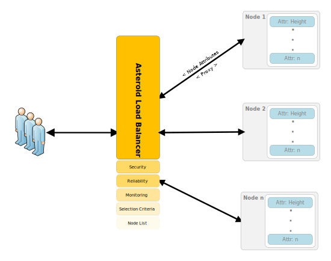

<p align="center">
  
</p>

<p align="center" style="font-size: 48px;">
  <strong>Asteroid Load Balancer</strong>
</p>

<p align="center">
  A load balancer for neo full nodes
</p>
<p align="center">
  <a href="https://goreportcard.com/report/github.com/Moonlight-io/asteroid-load-balancer">
    
  </a>
</p>
# Overview

Asteroid Load Balancer is a lightweight reverse proxy for neo full-nodes.  Currently, light applications need to manage node hopping to guarantee they are hitting a fully synched, available full-node.  This implementation provides an option for hitting a single server and allowing it to do the management and negotiation with full-nodes.

Additionally, a user may choose to run asteroid-load-balancer on top of a single full node.  This implementation provides a gate to protect the node.

The current platform is very simple and uses a polling method for tracking block height and node state.  Node selection is random, but will eventually be dependent on latency.  Further future improvements will include the addition of management tools.

The default deployment will register the City of Zion Nodes

Note: Listening port is 8080

<p align="center">
  
</p>

# Deployment
```sh
git clone https://github.com/Moonlight-io/asteroid-load-balancer.git
make build   
make run
```


*Note:* If you are having issues with the number of connections, consider increasing your ulimit -n
